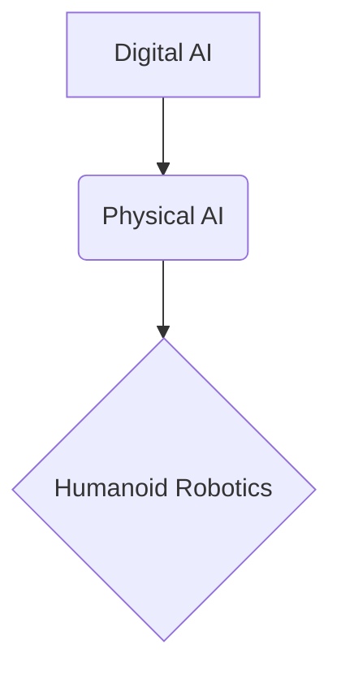

#  Physical AI & Humanoid Robotics Course

---

# Introduction to Physical AI

## What is Physical AI?

Physical AI refers to the branch of artificial intelligence that focuses on intelligent systems interacting with the physical world. Unlike traditional AI, which often operates purely in digital domains, Physical AI embodies intelligence in physical forms (like robots) that can perceive, reason, and act within real-world environments. This field is at the intersection of AI, robotics, computer vision, natural language processing, and control systems, enabling machines to perform complex tasks, adapt to changing conditions, and collaborate with humans in a tangible way.

## Motivating Humanoid Robotics

Humanoid robotics represents a frontier in Physical AI, aiming to create robots that resemble and interact with the world in a human-like manner. The motivation behind this pursuit is multifaceted:

*   **Natural Interaction**: Humanoid robots can operate in human-centric environments and use tools designed for humans, leading to more intuitive and seamless collaboration.
*   **Empathy and Acceptance**: A human-like form can foster greater empathy and acceptance from humans, which is crucial for roles in service, healthcare, and companionship.
*   **Complex Task Execution**: The versatility of the human form allows for a broad range of movements and manipulations, making humanoids capable of performing highly complex and diverse tasks in unstructured environments.
*   **Research Platform**: Humanoid robots serve as an unparalleled platform for research into human cognition, locomotion, and interaction, pushing the boundaries of AI and robotics.

## Course Roadmap and Learning Outcomes

This course is structured to provide a comprehensive understanding of Physical AI, with a particular focus on humanoid robotics, from foundational concepts to advanced applications.

### Learning Outcomes

Upon successful completion of this course, you will be able to:

1.  **Understand ROS 2 Architecture**: Grasp the core concepts of the Robot Operating System 2 and its role in coordinating robotic systems.
2.  **Develop Digital Twins**: Create and interact with simulated humanoid robots in environments like Gazebo and Unity, integrating various sensors.
3.  **Implement AI-Robot Brains**: Utilize advanced AI techniques with NVIDIA Isaac Sim and Isaac ROS for perception, synthetic data generation, and reinforcement learning.
4.  **Design Vision-Language-Action (VLA) Systems**: Integrate speech processing, large language model (LLM) planning, and robotic actions for end-to-end autonomous behaviors.

### Course Roadmap

The course is divided into several modules, progressively building your knowledge and practical skills:

*   **Introduction to Physical AI**: Current module, defining core concepts and course overview.
*   **Module 1: The Robotic Nervous System (ROS 2)**: Deep dive into ROS 2 for robot control.
*   **Module 2: The Digital Twin (Gazebo & Unity)**: Exploring robot simulation and sensor integration.
*   **Module 3: The AI-Robot Brain (NVIDIA Isaac)**: Advanced AI and simulation with NVIDIA tools.
*   **Module 4: Vision-Language-Action (VLA)**: Building multimodal AI systems for humanoids.
*   **Capstone Project**: An end-to-end integration project demonstrating all learned concepts.

## Prerequisites

To make the most of this course, it is recommended that you have:

*   Basic programming experience, preferably in Python.
*   Familiarity with fundamental robotics concepts.
*   A keen interest in AI, robotics, and their real-world applications.

## Reading List

*   **"Robotics, Vision and Control"** by Peter Corke
*   **"ROS 2 Documentation"**: Official online documentation for the Robot Operating System 2.
*   **"Deep Learning"** by Ian Goodfellow, Yoshua Bengio, and Aaron Courville (for advanced AI concepts).

---

## Conceptual Flow

