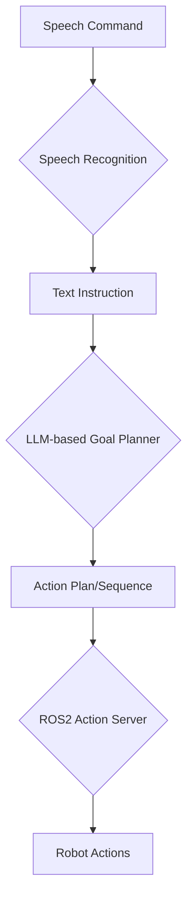

# Module 4: Voice-to-Language-to-Action (VLA)

This module explores the integration of voice commands with large language models (LLMs) to control robotic actions, forming a Voice-to-Language-to-Action (VLA) pipeline.

## VLA Concepts: Speech → LLM → Actions

The core idea behind VLA is to bridge the gap between human natural language instructions and robotic capabilities. This involves a multi-stage process:

1.  **Speech Recognition**: Converting spoken language into text.
2.  **Language Understanding and Planning (LLM)**: Processing the text instruction with an LLM to generate a high-level plan or sequence of actions for the robot.
3.  **Action Execution**: Translating the LLM's plan into concrete, executable commands for the robot's action server.



## Whisper Code Example

[Provide a simple Python code example using the Whisper library or API for speech-to-text conversion. Highlight key parts like loading the model and transcribing audio.]

## Goal Planner (LLM-based)

[Explain how an LLM can be used to interpret user commands and generate a sequence of robotic actions. Include a conceptual example of a prompt and expected LLM output for a simple task.]

## ROS2 Action Server Example

[Provide a basic ROS2 action server implementation in Python. Demonstrate how it receives a goal, executes a long-running task, and provides feedback/results. This should be a simplified example relevant to a robotic action.]

## End-to-End Voice-to-Action Walkthrough

[Describe a step-by-step walkthrough of the entire VLA pipeline, from a spoken command to the robot executing an action. This can be conceptual or reference a simplified simulation scenario.]

## Full Pipeline Diagram

[Insert a more detailed diagram showing the complete VLA pipeline, including ROS2 nodes, communication topics/actions, and the flow of data/control.]

```mermaid
graph LR
    SubGraph_Voice[Voice Input]
        S[Microphone] -- Audio --> A[Whisper Node (ROS2)]
    End

    SubGraph_LLM[Language Understanding & Planning]
        A -- Text --> B[LLM Planner Node (ROS2)]
        B -- Action Goal --> C[ROS2 Action Server]
    End

    SubGraph_Robot[Robot Execution]
        C -- Action Command --> D[Robot Control System]
        D -- Movement/Sensor Data --> E[Simulated Humanoid / Real Robot]
    End

    SubGraph_Feedback[Feedback & Perception]
        E -- Visual/Proprioceptive Data --> F[Perception Node (ROS2)]
        F -- Environment State --> B
        C -- Status/Result --> A
    End

    A -- "Speech-to-Text" --> B
    B -- "Planned Actions" --> C
    C -- "Execute Action" --> D
    D -- "Robot State" --> E
    E -- "Sensor Data" --> F
    F -- "Perceived Objects" --> B
    C -- "Action Feedback" --> B
```
